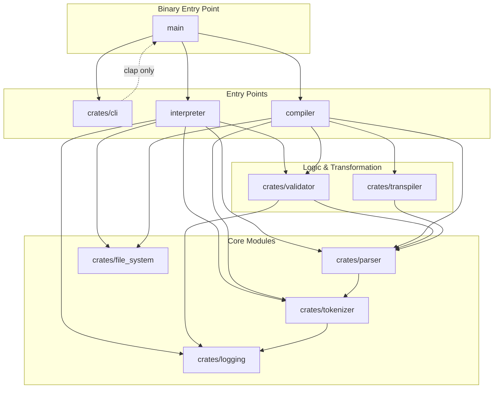

# Contributing to AzLang
Thank you for your interest in contributing to **AzLang**! This document provides an overview of the project architecture, dependency flow, and guidelines for contributing to the development of this programming language.
---
## 🏗️ Project Architecture
AzLang is built using a modular **Rust Workspace** approach. This allows the core logic to be shared between the interpreter and the compiler, ensuring consistency across different execution modes.
### Core Components
- **`crates/cli`**: Handles command-line argument parsing via `clap`. Does **not** depend on the interpreter or compiler — the main binary wires them together.
- **`interpreter`**: Executes the code directly by traversing the Abstract Syntax Tree (AST). Depends on `tokenizer`, `parser`, `validator`, `file_system`, and `logging`.
- **`compiler`**: Transforms the source code into a target language via the `transpiler` module. Depends on `tokenizer`, `parser`, `validator`, `transpiler`, and `file_system`.
- **`crates/`**: Internal libraries (crates) that handle specific tasks:
  - `tokenizer` — Lexical analysis; depends on `logging`.
  - `parser` — AST construction; depends on `tokenizer`.
  - `validator` — Semantic validation; depends on `parser` and `logging`.
  - `transpiler` — Code generation; depends on `parser`.
  - `file_system` — File I/O utilities; no internal dependencies.
  - `logging` — Shared logging utilities; no internal dependencies.

---
## 🔄 Dependency Flow
The following diagram illustrates how the different modules of AzLang interact with one another. Understanding this flow is crucial before making changes to the core logic.

---
# 🚀 Pull Request Template
## 📝 Description
Please provide a brief summary of the changes and which issue is fixed. Include relevant motivation and context.
Fixes # (issue number)
## 🛠️ Type of Change
Please check the options that are relevant:
- [ ] 🐛 Bug fix (non-breaking change which fixes an issue)
- [ ] ✨ New feature (non-breaking change which adds functionality)
- [ ] 💥 Breaking change (fix or feature that would cause existing functionality to not work as expected)
- [ ] 📖 Documentation update
- [ ] ⚡ Performance optimization
## 🎯 Impacted Modules
Which parts of the **AzLang** dependency flow does this PR affect?
- [ ] `crates/tokenizer`
- [ ] `crates/parser`
- [ ] `crates/validator`
- [ ] `crates/transpiler`
- [ ] `crates/file_system`
- [ ] `crates/logging`
- [ ] `interpreter`
- [ ] `compiler`
- [ ] `crates/cli`
- [ ] Other: __________
## 🧪 How Has This Been Tested?
Please describe the tests that you ran to verify your changes.
- [ ] Unit tests in the specific crate.
- [ ] Integration tests in `crates/tests`.
- [ ] Manual verification with an `.az` (or relevant extension) script.
## ✅ Checklist
- [ ] My code follows the **Rust 2024 Edition** coding standards.
- [ ] I have performed a self-review of my own code.
- [ ] I have commented my code, particularly in hard-to-understand areas.
- [ ] I have made corresponding changes to the documentation.
- [ ] My changes generate no new warnings.
- [ ] I have run `cargo fmt` and `cargo clippy`.
---
*AzLang - Empowering the future of programming.*
