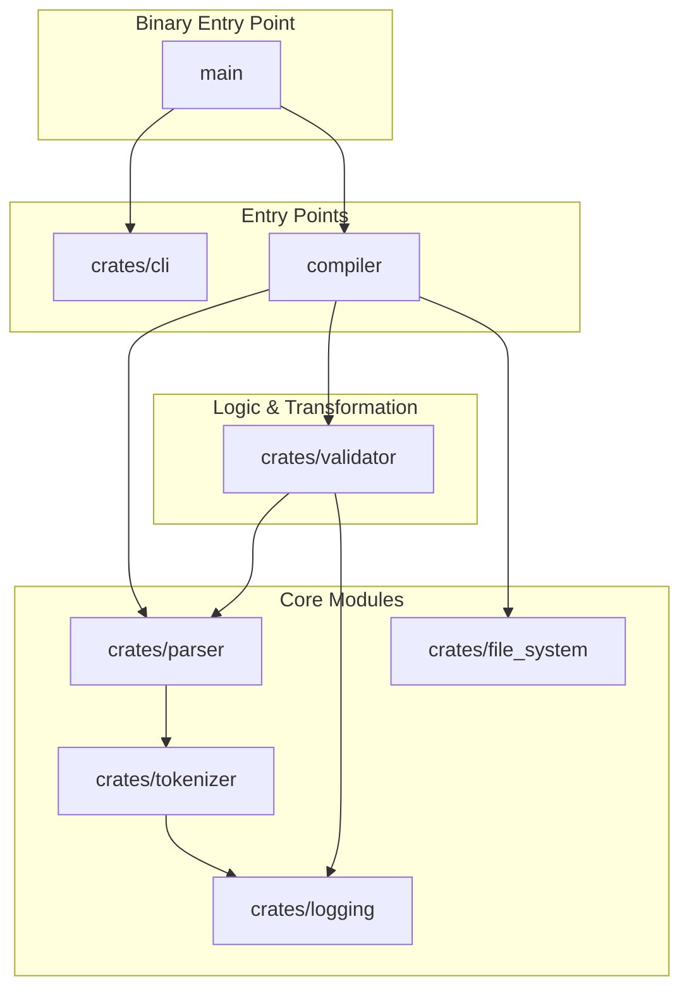

# Contributing to AzLang

Thank you for your interest in contributing to **AzLang**! This document describes the project architecture, dependency flow, and the guidelines for contributing to the development of this programming language.

---

## Project Architecture

AzLang is a **compiler**. Source code is read, tokenized, parsed into an AST, validated, and then planned for code generation. There is no runtime interpreter for `.az` files.

AzLang is built as a modular **Rust Workspace**.

### Core Components

- **`src/`** — The binary entry point. It parses CLI arguments and wires the `compiler`.
- **`crates/cli`** — Command-line argument parsing via `clap`. It does **not** depend on the compiler.
- **`compiler`** — Reads the source file, runs the parser and validator, and drives code generation. Depends on `parser`, `validator`, `file_system`, and `logging`.
- **`crates/`** — Internal libraries that handle specific tasks:
  - `parser` — Tokenizes and parses source code into an AST; depends on `tokenizer`.
  - `tokenizer` — Lexical analysis; depends on `logging`.
  - `validator` — Semantic and type validation; depends on `parser` and `logging`.
  - `file_system` — File I/O utilities; no internal dependencies.
  - `logging` — Shared logging utilities; no internal dependencies.

> **Design principle:** Large modules (`compiler`) do not depend on low-level crates like `tokenizer` directly. All source processing is initiated through `parser`, which owns the full pipeline from raw source to AST.

---

## Dependency Flow

The following diagram illustrates how the modules of AzLang interact.

```mermaid
graph TD
    subgraph "Binary Entry Point"
        MAIN[main]
    end
    subgraph "Entry Points"
        CLI[crates/cli]
        COMP[compiler]
    end
    subgraph "Logic & Transformation"
        VAL[crates/validator]
    end
    subgraph "Core Modules"
        PRS[crates/parser]
        TOK[crates/tokenizer]
        FS[crates/file_system]
        LOG[crates/logging]
    end

    %% Main wires everything together
    MAIN --> CLI
    MAIN --> COMP

    %% Compiler Flow
    COMP --> PRS
    COMP --> VAL
    COMP --> FS

    %% Internal Dependencies
    VAL --> PRS
    VAL --> LOG
    PRS --> TOK
    TOK --> LOG
```

---

## Pull Request Template

## Description

Please provide a brief summary of the changes and which issue is fixed. Include relevant motivation and context.
Fixes # (issue number)

## Type of Change

Please check the options that are relevant:

- [ ] Bug fix (non-breaking change which fixes an issue)
- [ ] New feature (non-breaking change which adds functionality)
- [ ] Breaking change (fix or feature that would cause existing functionality to not work as expected)
- [ ] Documentation update
- [ ] Performance optimization

## Impacted Modules

Which parts of the **AzLang** dependency flow does this PR affect?

- [ ] `crates/tokenizer`
- [ ] `crates/parser`
- [ ] `crates/validator`
- [ ] `crates/file_system`
- [ ] `crates/logging`
- [ ] `compiler`
- [ ] `crates/cli`
- [ ] Other: __________

## How Has This Been Tested?

Please describe the tests that you ran to verify your changes.

- [ ] Unit tests in the specific crate.
- [ ] Integration tests in `crates/tests`.
- [ ] Manual verification with an `.az` script.

## Checklist

- [ ] My code follows the **Rust 2024 Edition** coding standards.
- [ ] I have performed a self-review of my own code.
- [ ] I have made corresponding changes to the documentation.
- [ ] My changes generate no new warnings.
- [ ] I have run `cargo fmt` and `cargo clippy`.

---

*AzLang - Empowering the future of programming.*